## About Translation

**[English Mannual](./README_en.md)** 

**Developer**: My home language is Chinese, so the original UI is in Chinese, if you want to help translating this software, you can open the **[./languages/README.md](./languages/README.md)** to check out how you can help. 


#   Quick Cut

**Quick Cut** 是一款轻量、强大、好用的视频处理软件。它是一个轻量的工具，而不是像 Davinci Resolve、Adobe Premiere 那样专业的、复杂的庞然大物。Quick Cut 可以满足普通人一般的视频处理需求：压缩视频、转码视频、倒放视频、合并片段、根据字幕裁切片段、自动配字幕、自动剪辑……

它是开源的，你可以免费使用它。

Gitee 地址：https://gitee.com/haujet/QuickCut

GitHub 地址：https://github.com/HaujetZhao/QuickCut

界面预览：

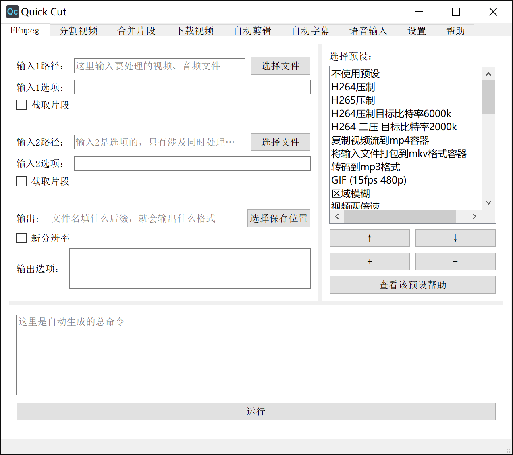


## 📝 背景

好几年前，有一次想将一个视频中的片段剪出来，才发现，市面上根本没有给普通用户用的视频处理软件。

我去百度、知乎上搜【视频剪辑软件】，陆续得到了以下结果：

- **Adobe Premiere**，正版一年上千元、随时【停止运行】的专业剪辑软件
- **Vegas** 等专业软件就不再列了
- **爱剪辑**，一个导出就带推广片头的中文剪辑软件
- **格式工厂**，一个老牌的国产转码编辑软件
- **小丸工具箱**，一个从 Bilibili 知道的压制软件
- 还有大大小小的其它软件

我就只想剪一小个片段啊！专业软件学不起、买不起、电脑太卡带不起！可是其它小软件、许多国产剪辑软件，都有这一些问题：

- 国外软件选项太多，各种参数看不懂。
- 多数免费软件都带水印，或者导出后画质会下降，要么导出的体积巨大，耗时长不说，还不是无损剪辑。

用的最好的还是 **格式工厂** 和 **小丸工具箱** 。但他们都功能很少，还有小丸工具箱，官网的下载地址是百度网盘链接已经挂了，也不知道从第三方下载的版本有没有木马、广告……

后来，从视频压制这个话题，我知道了 **FFmpeg** 这个神级开源工具，它的功能之强大、应用之广泛到惊了我的下巴！但它是个命令行工具，到百度上一搜，也只是些文章说怎样怎样的命令可以做什么、常用命令有什么。相关的图形界面工具，一个好用的都没有！（当然要点名表扬下 Lossless Cut，它还是很好用的，只是功能太少）。没有一个软件能让 FFmpeg 在普通大众用户手中发挥潜力，真是可惜了！

于是一通操作，把 FFmpeg 的官方文档逐句做了翻译，记了笔记，然后用它来处理视频，真是畅快！免费、无广告，剪出来的视频也可以画质无损。100 兆的视频压缩到 10 兆，肉眼画质无损，那是一个巴适！

但是有一个问题！每次要处理一个视频，都要手动输入命令行，非常的麻烦，有时候忘记执行某个操作是用哪个参数了，还要去翻笔记，难受！于是我就想做一个图形界面工具，想要做什么，在里面点两下，命令参数啥的都是自动生成，最后点击运行就好。于是先后做了基于 **Tasker** 的安卓端 FFmpeg GUI Tool、基于 **Quicker** 的 FFmpeg GUI Tool。

但是上面两个平台都局限太多，想要好用，还是得自己做 GUI。我自己只是入门 python 的水平，只能硬着头皮花了几天在学习平台 B 站看完了 PyQt 的入门。然后边查边做，因为 PyQt 的注释很少，有时一个简单的小细节要花半天到一天处理。最后，成品还是出来了！

当然，除了 **FFmpeg** 的功能外，我还做了 **语音自动转字幕** 功能。这里，我要不指名地 Diss 一些商家：

- 首先是价格，贵的要 1元/分钟，便宜些的也要 4毛/分钟！转个 20 分钟的视频，就要收我 8 元，抢钱呐！啊？你们是没有语音引擎的，都是用的 API，大批量采购，你们用的 API 价格也就 1.2 元/小时 左右吧！用 API 成本几十倍的价格提供服务，这吃相，真是难看。
- 然后是上传视频。语音转字幕，上传音频便足以，一些商家却需要上传完整视频！2GB 的视频，通常其音频只有几十 MB 左右。你们是你们觉得：用户见转写了几十 MB 的视频，会觉得这么小的文件，1元/分钟的价格不值，转写了 2GB 的视频，一看这转写体积，就觉得花钱花的值？

在 Quick Cut 里，我做了 **语音自动转字幕** 功能，可以使用阿里或腾讯的 Api。就以阿里的 API 为例，普通元套餐的商用价格是 2.5 元/小时，四十五几乎就是不要钱！下面的帮助里，我写下了申请阿里 API 的教程，只要填入 API，就可以使用语音转字幕了。

另外，我还将另一个 **自动剪辑神器** 放进了 Quick Cut，将你的 Vlog、视频教程一键自动剪好。下面会有详细介绍。

同时，推荐 Quick Cut 中一个对学习外语的同学非常有用的功能：**将字幕中的每一句话对应的视频剪成片段提取出来**。用于制作外语学习的视频素材爽的不要不要的！应该算是 **Anki** 用户的一个福利功能吧！


## ✨ 特性

- 简单的界面
- FFmpeg 预设丰富
- 可自定义预设
- 合并视频片段
- 逐句提取每句字幕对应的视频片段
- 自动转字幕
- 自动剪辑
- ……更多待探索


## 🔮 界面和功能介绍

### FFmpeg 界面

在这个界面，你可以使用许多 ffmpeg 预设，对音视频进行处理，比如说：

我想将手机上录制的视频压制下，减小它的大小，那么只需要：先在 **输入1** 框输入待压制的视频文件（此时会自动生成输出文件名），再在右侧预设列表选择 **H264压制** 预设（此时会自动生成总命令），最后点击底部的 **运行** 按钮，就会启动压制了。

**还有啊，转格式是基本操作！输出框的后缀名填什么，就会输出对应的格式！**

[点击去查看 Quick Cut 压制的视频教程](https://www.bilibili.com/video/BV18T4y1E7FF?p=1)

[点击去查看 Quick Cut 预设讲解视频教程](https://www.bilibili.com/video/BV18T4y1E7FF?p=2)

### 分割视频界面

这个界面有三个功能：根据字幕分割视频、根据大小分割视频、根据时长分割视频。

根据字幕分割视频是个神级功能，尤其适合于制作外语学习的视频素材。将例如美剧的视频放进去，再把相应的字幕文件放进去，就可以将每一句字幕对应的视频片段剪出来！如果你的字幕时间轴和视频时间轴有偏差，还可以进行手动的校准。

根据时间分割视频和根据大小分割视频主要是针对分享到短视频平台和微信平台的。

[点击去查看 Quick Cut 分割视频的视频教程](https://www.bilibili.com/video/BV18T4y1E7FF?p=3)

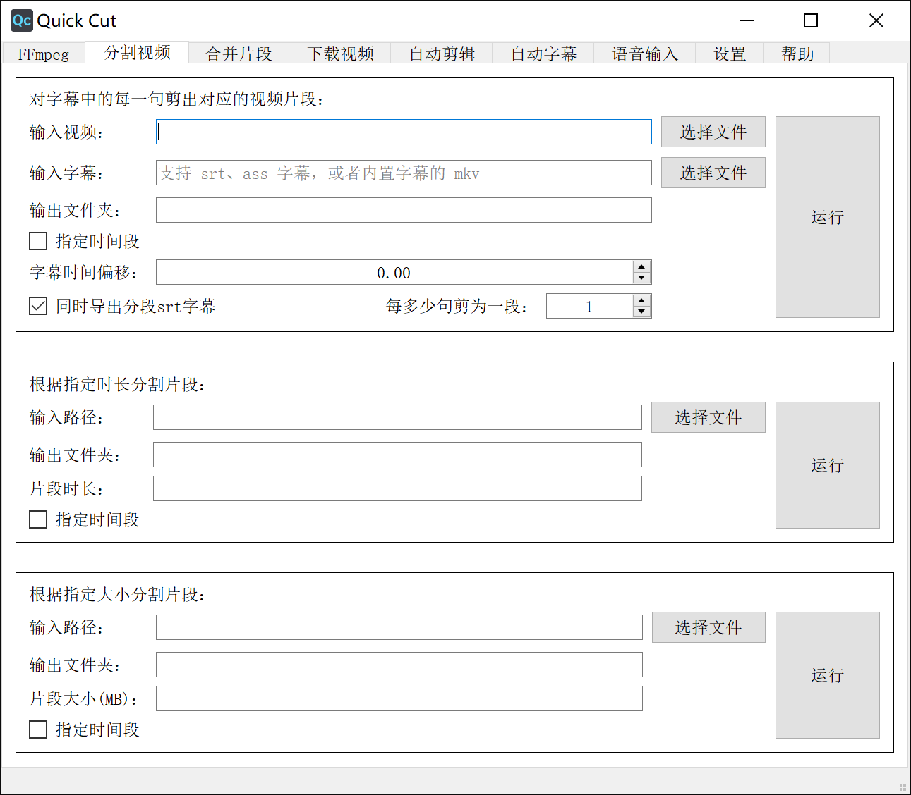

### 合并片段界面

这个简单，要合并的视频拖进去，调整下顺序，点击运行，就可以将这些视频合并成一个文件。从 ig 下载的 15 秒 story 视频片段就可以轻松合并啦！

[点击去查看 Quick Cut 合并片段的视频教程](https://www.bilibili.com/video/BV18T4y1E7FF?p=4)

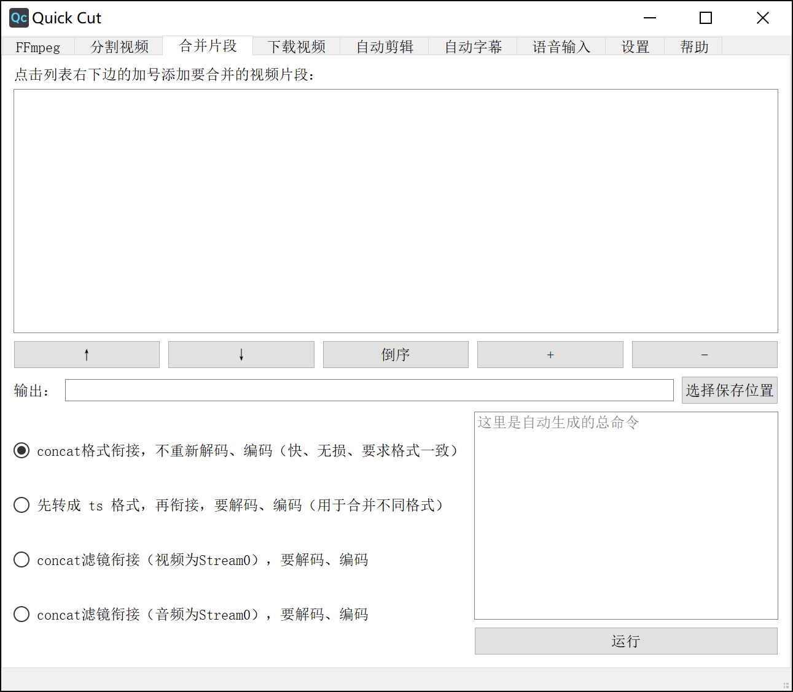

### 下载视频界面

这个界面提供了两个命令行工具的图形界面用于下载视频，最简单的用法就是将链接复制进去，然后点击下载。支持的网站有很多比如优酷、B站、YouTube、P站（逃）……

另外你还可以在里面设置cookies，就能够用你大会员身份登录的 cookie 信息下载大会员视频画质了。

[点击去查看 Quick Cut 下载视频的视频教程](https://www.bilibili.com/video/BV18T4y1E7FF?p=5)

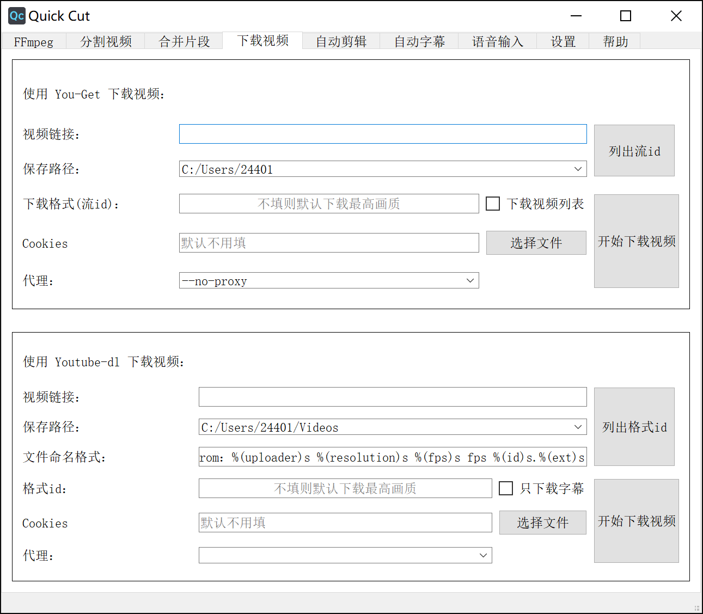

### 自动剪辑界面

自动剪辑的原理是通过给视频中有声音的片段和没有声音的片段施加不同的播放速度，达到只保留有关键信息部分的效果，非常适合做vlog和视频教程。

同时你也可以选择使用阿里云或者腾讯云的语音服务，先将视频转出字幕之后，再根据字幕中的关键词对视频片段进行保留和删除操作。

除了下面那个演示视频，在本教程中的所有视频，都使用了自动剪辑，然后才上传的。

[点击去查看 Quick Cut 自动剪辑的效果演示视频](https://www.bilibili.com/video/BV18T4y1E7FF?p=6)

[点击去查看 Quick Cut 自动剪辑的视频教程](https://www.bilibili.com/video/BV18T4y1E7FF?p=7)

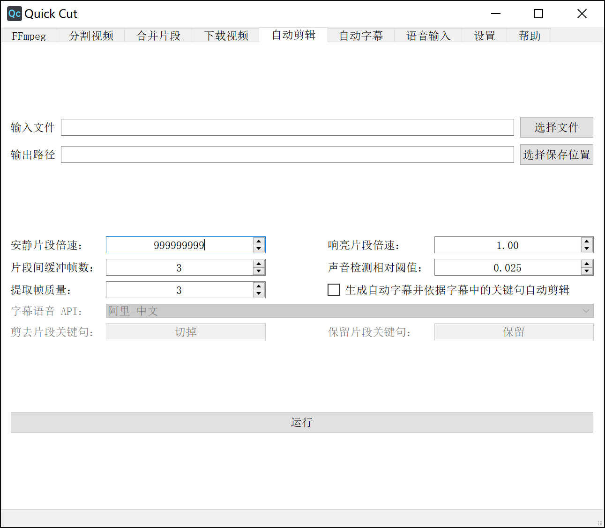

### 自动转字幕界面

只要将你的视频或者音频文件拖进去，然后点击运行，就可以生成一个srt格式的字幕。

语音识别方面使用了阿里云或者腾讯云的引擎，准确率有95%以上。如果想给自己的视频配字幕，就可以先用这个功能，自动转出字幕之后，再手动修改一下里边偶尔的错别字，效率非常高。

语音识别引擎需要用户自己去阿里云官网申请 API 才能用（对申请过程我做了[视频教程](https://www.bilibili.com/video/BV18T4y1E7FF?p=11)）。阿里云的语音服务开通后，每个新用户有3个月的免费试用时间，在这3个月内，每天都有两小时的录音文件转换额度。试用期过后，商业版的价格是每小时音频转换2.5元，随着使用量的增加，这个价格还会更低。如果买1000小时的套餐，价格可以低到1.5元每小时。

如果你对比一下目前网上能找到的视频转字幕服务，你就会知道 Quick Cut 的这个转字幕功能有多便宜：

- 网易见外工作台，普通的视频转字幕，收费1元每分钟，60元每小时。英文转字幕价格翻倍。
- 号称全网最低价的突字幕，收费0.005元每秒，3毛每分钟，18元每小时。
- Arctime 收费30积分每分钟，也就是3毛每分钟，18元每小时。

来对比一下：阿里云 2.5 元每小时，前三个月每天免费用两小时，用得越多价，格还会更低。

腾讯云方面的价格还会更低，只是转换速度没有阿里云快。所以推荐使用阿里云。就算是用商业版每小时2.5元的价格也不心疼。

如果你急着把最新的美剧视频下载下来，字幕组还没有出字幕，但是生肉太难啃，就可以用这个转字幕功能，将英文字幕转出来，配合着看。

如果你是视频工作者、UP主、视频公司负责人，平常有大量的视频需要转换字幕，用这个就可以舍去使用其他网上平台导致的每小时几十元的成本，一个月下来成本或许能节约到上千元。。

哎，说实话，要是这软件推广开来，对一些视频转字幕的服务商，真的是断人财路，杀人父母。

[点击去查看 Quick Cut 自动转字幕的演示](https://www.bilibili.com/video/BV18T4y1E7FF?p=8)


### 语音识别输入界面

如果你已经添加上阿里云的语音引擎，就可以使用阿里云的一句话识别服务进行语音识别输入。在任意界面，只要长按键盘上的大写锁定键超过0.3秒钟，就可以开始说话，进行语音识别。松开按键之后，识别结果会自动打到输入框。

有人推荐使用讯飞的语音识别，但是讯飞语音识别的快捷键在 F6 那个位置，离主键盘的位置非常远，手指够过去费劲；而且那里有很多大小一样的按键，这个快捷键也不好找；他还会和很多软件的快捷键冲突。

而长按大写锁定键进行语音识别就非常方便，离打字的手非常近，需要的时候很轻松就能按到，也不会有快捷键冲突。

阿里云语音识别的准确率非常高，这篇文章大部分都是用这个语音识别功能打的，然后修改了少量错字。

[点击去查看 Quick Cut 语音识别输入的演示](https://www.bilibili.com/video/BV18T4y1E7FF?p=9)

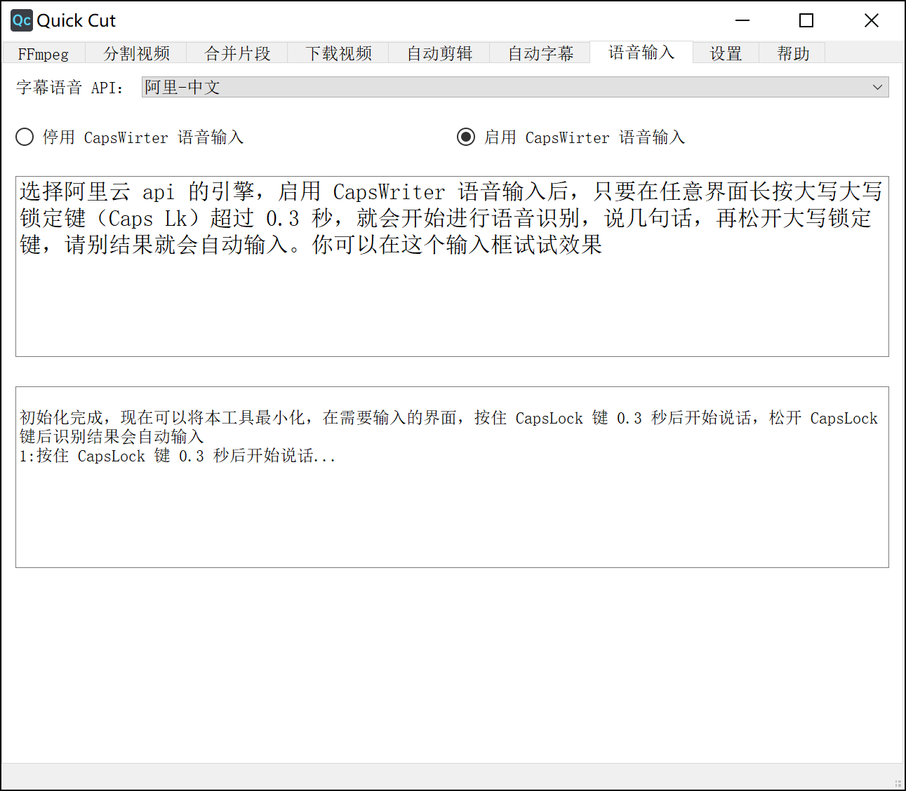

### 设置界面

在设置界面你就可以在这里配置语音识别的引擎。

勾选上 **点击关闭按钮时隐藏到托盘** ，就可以让软件常驻到后台，方便快捷的调出来剪辑视频、语音输入。Quick Cut 的资源占用量非常少，可以放心的放到后台，不影响性能。

[点击去查看 Quick Cut 配置阿里云语音识别引擎的视频教程](https://www.bilibili.com/video/BV18T4y1E7FF?p=9)


### 帮助界面

在帮助见面里，有如下按钮，见名知意：

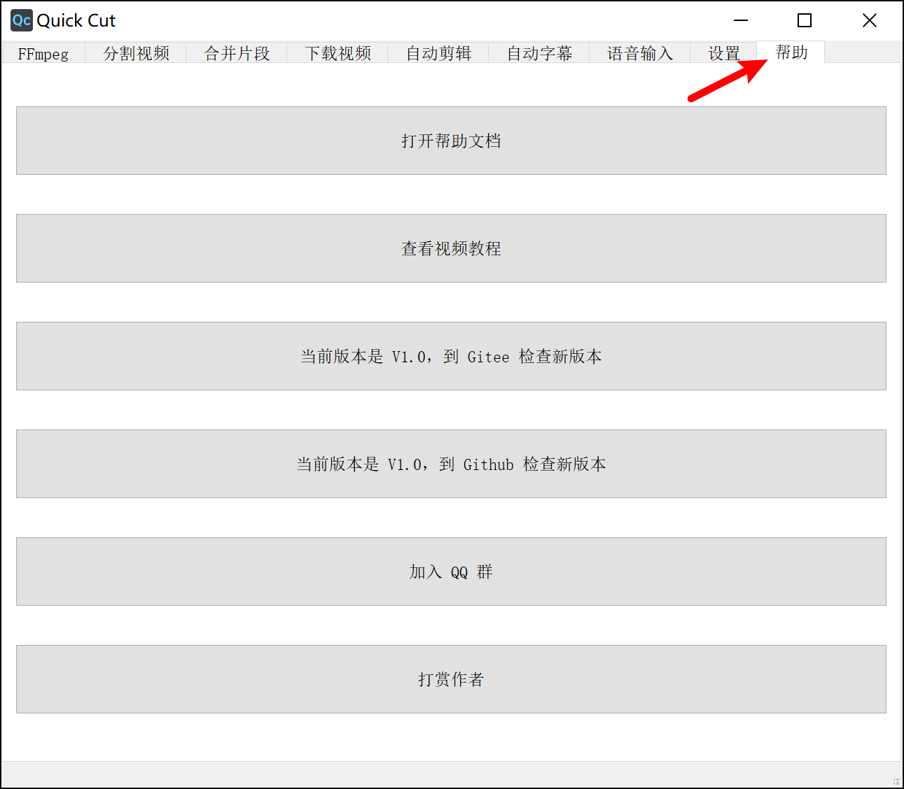


## 🔨 开发

这一节普通用户就不用看了。你们只要到发布界面下载使用已打包好的软件就行了，如果你想对源代码进行修改，就可以看下这一节。

### 搭建环境

你需要 pip 安装这些包：

```
srt
keyboard
numpy
setuptools
aliyun-python-sdk-core
PyQt5
audiotsm
scipy
cos-python-sdk-v5
tencentcloud-sdk-python
oss2
pyaudio
auditok @ git+https://github.com/amsehili/auditok@v0.1.8
```

其中，pyaudio 很难安装！编译成功有很多要求。所以 Windows 用户可以直接到 [这里](https://www.lfd.uci.edu/~gohlke/pythonlibs/#pyaudio) 下载上它已经被志愿者编译好的 whl 包，用 pip 安装，注意下载对应你 python 版本的包。

Linux 的用户，经 @**[shniubobo](https://github.com/shniubobo)** 的测试，Ubuntu 用户在安装 pyaudio 前只要装这个就行了：

```
sudo apt install portaudio19-dev
```


其他包可以通过[requirements.txt](requirements.txt)安装：

```
pip install -r requirements.txt
```

#### 阿里云语音识别 sdk

然后还需要安装阿里云语音识别引擎的sdk， [这篇阿里云官方文档](https://help.aliyun.com/document_detail/120693.html?spm=a2c4g.11186623.6.569.27675df0FENQ6O) 只说了用下面的方法安装：

```
pip install setuptools
```

[下载Python SDK](http://download.taobaocdn.com/freedom/33762/compress/alibabacloud-nls-python-sdk.zip)。

```
 # 打包 python setup.py bdist_egg # 安装 python setup.py install
```

不过有用户反馈可以用下面这个命令直接安装，不过我还没试验：

```
pip install aliyun-python-sdk-nls-cloud-meta
```


### 运行问题：

安装完依赖之后开始运行脚本，你可能会遇到这些问题：

- 安装完依赖后，你运行脚本，却发现 `import oss2` 时提示出错：`No module named 'winrandom'`，这时，你需要修改 `Python38\Lib\site-packages\Crypto\Random\OSRNG` 下的 `nt.py` 文件，将 `import winrandom` 修改为：`from Crypto.Random.OSRNG import winrandom` 

这些问题的原因是一些模块用了其它依赖，而这些其它依赖已经好久没更新了。只能遇到一个问题就搜一下，解决掉。上面这些问题都是我遇到后，在网上找了解法，根据自己的情况做了改动，使得问题得以解决。

**Mac 和 Linux 用户请注意：**

为了在 Windows 上运行时候不弹黑窗口，我在用 subprocess 的时候用了一个  `subprocess.STARTUPINFO()` 类，但是在 Linux 或 Mac 上好像不能用它，所以你们在使用前，要删除几段代码：

首先是末尾的这三行：

```
subprocessStartUpInfo = subprocess.STARTUPINFO()
subprocessStartUpInfo.dwFlags = subprocess.STARTF_USESHOWWINDOW
subprocessStartUpInfo.wShowWindow = subprocess.SW_HIDE
```

然后再全局搜索 `, startupinfo=subprocessStartUpInfo` 将其删掉。理论上就好了。

搭建好环境可以运行之后，如果修改了源代码然，后要进行发布，就应当打包成可以独立运行的exe文件，下面提供两种方法进行编译打包：

### 使用 nuitka 编译：

使用它打包出来的程序运行更快，只是相对步骤多一些。

先下载安装上 [MinGW64 8.1](https://sourceforge.net/projects/mingw-w64/files/)

再安装上 nuitka：

```
pip install nuitka
```

在实际编译的时候，先使用这个命令进行编译：

```
nuitka --mingw64  --standalone --show-progress --show-memory --plugin-enable=qt-plugins --plugin-enable=pylint-warnings --recurse-all --recurse-not-to=numpy,jinja2 --windows-icon=icon.ico --nofollow-imports --assume-yes-for-downloads --output-dir=out QuickCut.py
```

这时，可能会遇到如下错误：


就是因为代码里面有中文字符，默认使用的英文编码在转码时出现了错误，你就需要找到并打开最后指示的那个 **MainControl.py** 文件，将里面出错的那一行的 **latin1** 修改为 **utf-8** ，然后就可以编译成功。

以后其实还并不能运行，因为 nuitka 对于某些包并不会自动导入，还需要你手动导入才行。

所以在实际编译的时候，还是先使用这个命令进行编译：

```
nuitka --mingw64  --standalone --show-progress --show-memory --plugin-enable=qt-plugins --plugin-enable=pylint-warnings --recurse-all --recurse-not-to=numpy,jinja2 --windows-icon=icon.ico --nofollow-imports --assume-yes-for-downloads --output-dir=out QuickCut.py
```

然后再编译的导出目录在命令行窗口中将 **QuickCut.exe** 打开，会看到类似这样的错误：

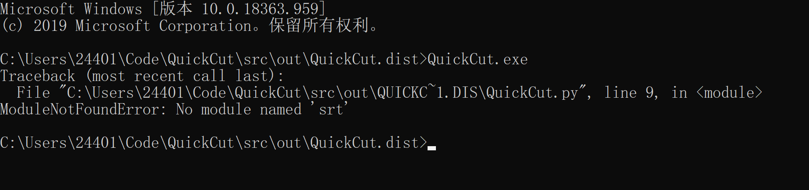

这时候，就需要亲自到 Python 的安装目录下找到这个包：

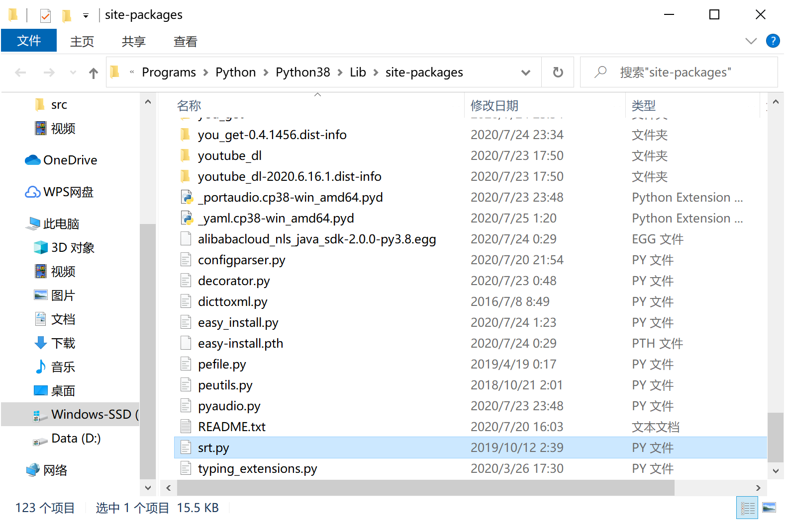 


将它手动复制到导出目录的根目录中：

 

重复运行，再次出现包缺失：

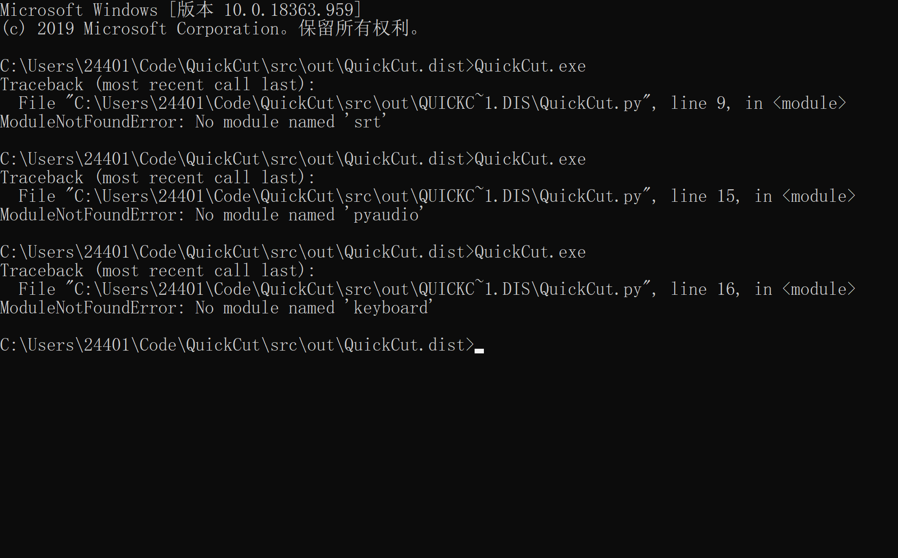

都需要找到这个包：

 

粘贴到编译导出目录的根目录中。这个过程要重复很多次，直到将所有缺失的包都复制到导出目录。

你可以将这些需要手动导入的包都再复制到另一个文件夹做备份，再次编译后，直接复制进去就行。

编译完成，你启动后可能是这个样子的：

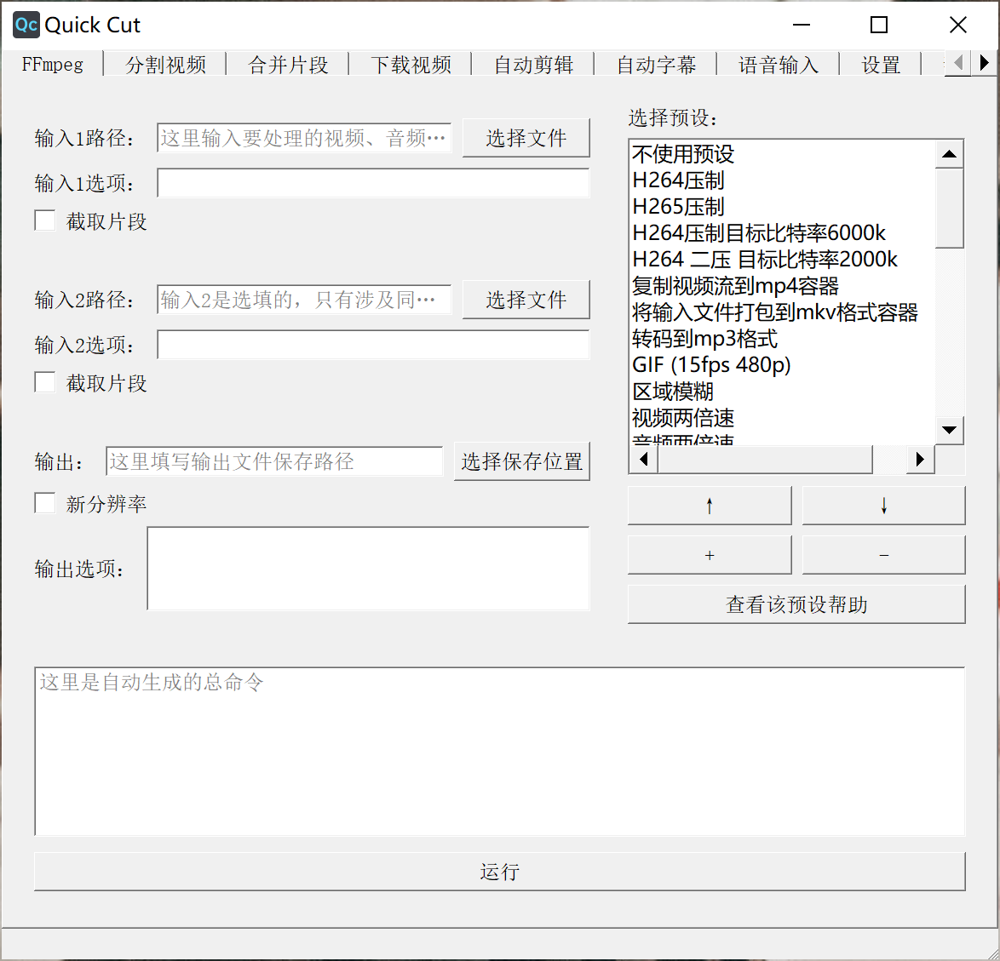

长得很丑对吧。这是因为缺失了 styles 文件夹，你需要到 PyQt5 的安装目录，找到 styles 文件夹：

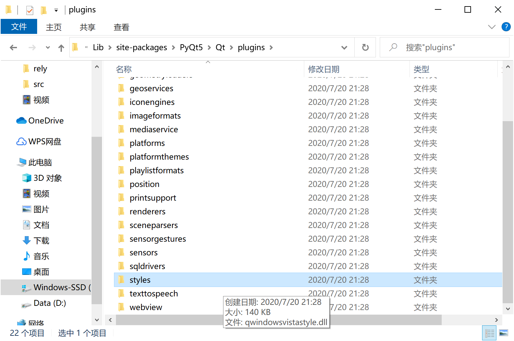

将其复制到编译导出目录的根目录之后，再次启动就正常了。

还有，记得将 icon.ico 、sponsor.jpg、README.html 复制到编译导出的文件夹，没有图标文件的话，就无法启动托盘。

再次编译。测试成功后，就可以使用下面这个命令进行编译：

```
nuitka --mingw64 --windows-disable-console --standalone --show-progress --show-memory --plugin-enable=qt-plugins --plugin-enable=pylint-warnings --plugin-enable=numpy --recurse-all --recurse-not-to=numpy,jinja2 --windows-icon=icon.ico --nofollow-imports --assume-yes-for-downloads --output-dir=out QuickCut.py
```

这样就可以将命令行窗口隐藏。

如果你是 Mac 编译，为了图标格式兼容，要使用：

```
nuitka --mingw64 --windows-disable-console --standalone --show-progress --show-memory --plugin-enable=qt-plugins --plugin-enable=pylint-warnings --plugin-enable=numpy --recurse-all --recurse-not-to=numpy,jinja2 --windows-icon=icon.icns --nofollow-imports --assume-yes-for-downloads --output-dir=out QuickCut.py
```


### pyinstaller 编译：

先安装上 pyinstaller ：

```
pip install pyinstaller
```

直接使用这个命令进行编译：

```
pyinstaller --hidden-import pkg_resources.py2_warn --noconfirm -w -i icon.ico QuickCut.py
```

如果你是 Mac 编译，为了图标格式兼容，要使用：

```
pyinstaller --hidden-import pkg_resources.py2_warn --noconfirm -w -i icon.icns QuickCut.py
```

其中，`--hide-import pkg_resources.py2_warn` 这一句比较重要，其实整个软件用到了这个模块，但是 pyinstaller 没有自动编译进去。当你电脑上的 setuptools 版本在 45.0.0 到 49.1.1 之间时，会出现这个问题。将 setuptools 升级到最新，应该就不会有这个问题了：

```python
pip install pyinstaller
pip install setuptools --upgrade
pyinstaller -wy -i icon.ico QuickCut.py  # Windows 用户用这个
pyinstaller -wy -i icon.icns QuickCut.py # 为了图标格式兼容，Mac 用户请用这个
```


### 编译后打包后要做的事

编译完成后，还有几个事要做，首先，下载对应系统的 [ffmpeg 和 ffprobe](http://ffmpeg.org/download.html) 放到编译根目录，再把本 `README.md` 导出成 `README.html` ，同 `icon.ico`、`sponsor.jpg`、`languages` 一起放入编译根目录（Mac 用户放 `icon.icns`），再下载对应系统的 [annie](https://github.com/iawia002/annie/releases) 放入编译根目录。

如果是 Mac 、Linux 打包的，那一定要给编译目录下的可执行文件用 `chmod +x` 授予可执行权限！

然后就可以打包了，Windows 下可以打包成 `7z` 格式，Mac、Linux 用户不要打包` zip`、`7z` 格式！因为这会让可执行文件的权限消失！Mac、Linux 用户可以用 `tar.gz` 或者 `dmg` 格式打包。

建议打包后的命名成类似 `QuickCut_Mac_v1.2.0_pyinstaller.dmg` 这样的。如果你是志愿者，为这个项目打包，你也可以在命名后面加上你的 id 等信息。

在发包的时候，建议上传到蓝奏云、天翼云，新建一个文件夹，将包放到这个文件夹里，再把这个文件夹的分享链接发出来，这样，以后要更新的话，只要把新版本放到那个文件夹，分享链接就不用变了。

你可以将打包好的云盘文件夹链接发给作者，作者会把这个链接放到 release 页面。

## ☕ 打赏

万水千山总是情，一块几块都是情。本软件完全开源，用爱发电，如果你愿意，可以以打赏的方式支持我一下：


## 😀 交流

如果有软件方面的反馈可以提交 issues，或者加入 QQ 群：[1146626791](https://qm.qq.com/cgi-bin/qm/qr?k=DgiFh5cclAElnELH4mOxqWUBxReyEVpm&jump_from=webapi) 


## 🙏 鸣谢

感谢知乎上的 @[Python与模具](https://www.zhihu.com/people/xuhui112-ben) 的帮助，让我得以用 nuitka 对软件进行打包。
